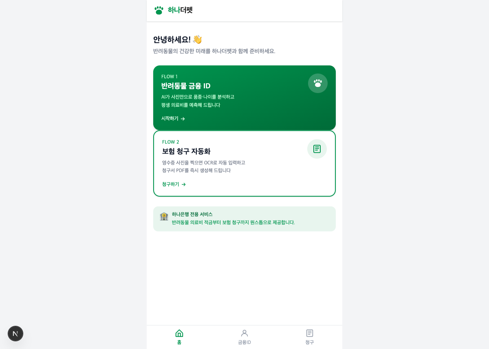
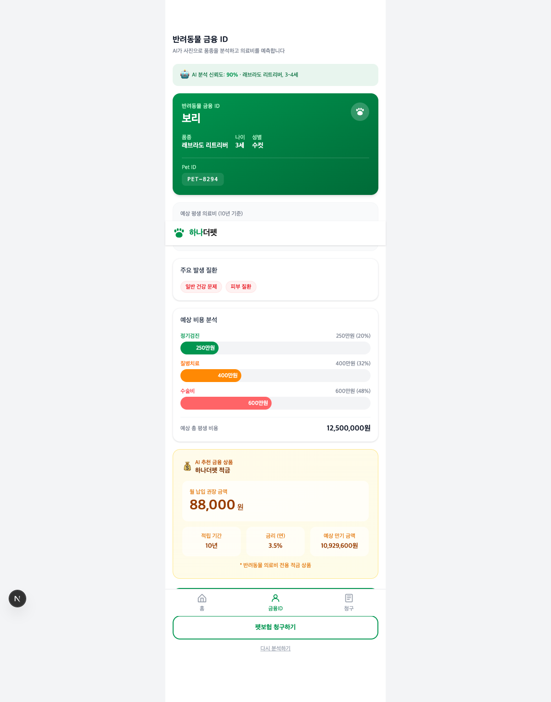
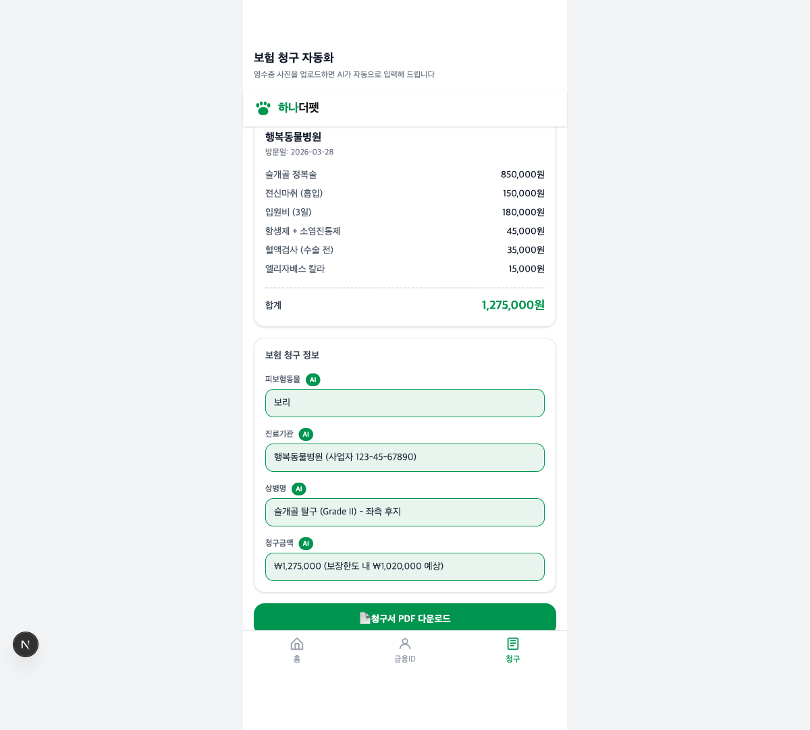

# HanaThePet (하나더펫)

**입양 첫날의 설렘을 15년의 안심으로 바꾸는 가장 똑똑한 동행.**

AI가 설계하는 생애 재무 플랜부터 보험 청구 자동화까지, 하나금융그룹이 당신의 반려동물을 위한 '세상에 없던 가족'이 됩니다.

---

## Screenshots

### 홈 화면


### Flow 1: AI 펫 금융 ID
반려동물 사진을 업로드하면 AI가 품종과 나이를 분석하고, 생애 의료비를 예측하여 맞춤 적금을 추천합니다.



### Flow 2: AI 보험 청구 자동화
동물병원 영수증을 촬영하면 AI OCR이 자동으로 정보를 추출하고, 보험 청구서를 PDF로 생성합니다.



---

## 핵심 기능

### 1. AI 펫 금융 ID (Pet Financial ID Card)
- 반려동물 사진 업로드 → GPT-4o Vision이 **품종, 나이, 건강 상태** 자동 분석
- 품종별 빅데이터 기반 **생애 의료비 예측** (정기검진/질병치료/수술비 breakdown)
- AI가 계산한 **월 납입금 추천** → 하나더펫 적금 연동
- 맞춤 **펫보험 상품 추천** (베이직/프리미엄)

### 2. AI 보험 청구 자동화
- 동물병원 영수증 촬영 → GPT-4o Vision **OCR로 자동 인식**
- 진료기관, 진료일, 상병명, 항목별 비용 **자동 추출 + 청구서 폼 자동 채움**
- AI가 채운 필드는 녹색 **"AI" 뱃지**로 표시, 사용자 수정 가능
- **PDF 보험 청구서 자동 생성** 및 다운로드

---

## Tech Stack

| Layer | Technology |
|-------|-----------|
| Frontend | Next.js 14, Tailwind CSS, TypeScript |
| Backend | FastAPI, Python 3.9+ |
| AI | OpenAI GPT-4o Vision API |
| PDF | WeasyPrint + Jinja2 |
| Data | 20개 품종별 비용 매트릭스 (JSON) |

---

## Quick Start

### Backend
```bash
cd backend
python3 -m venv .venv
source .venv/bin/activate

# macOS: WeasyPrint 시스템 의존성
brew install cairo pango

pip install -r requirements.txt

# .env 파일에 OpenAI API 키 설정
echo "OPENAI_API_KEY=sk-your-key" > .env

PYTHONPATH=. uvicorn main:app --reload --port 8000
```

### Frontend
```bash
cd frontend
npm install
npm run dev
```

`http://localhost:3000` 에서 확인

---

## API Endpoints

| Method | Path | Description |
|--------|------|-------------|
| GET | `/api/health` | Health check |
| POST | `/api/pet/analyze` | 반려동물 사진 분석 + 금융 ID 생성 |
| POST | `/api/claim/ocr` | 영수증 OCR 분석 |
| POST | `/api/claim/generate-pdf` | 보험 청구서 PDF 생성 |

---

## 10x Vision (Post-Hackathon)

- **Pet Financial Twin**: 펫사랑 카드 결제 데이터로 예측 모델 개인화
- **블록체인 의료기록**: 동물병원 진료 기록 자동 확인, 중복 검사 방지
- **전체 생애주기 금융 플랜**: 입양 → 건강관리 → 시니어 케어 → 무지개다리
- **유기동물 후원 ESG 펀드**: 납입액 일정 비율 자동 적립

---

## License

This project was created for the Hana Financial Group Hackathon.
